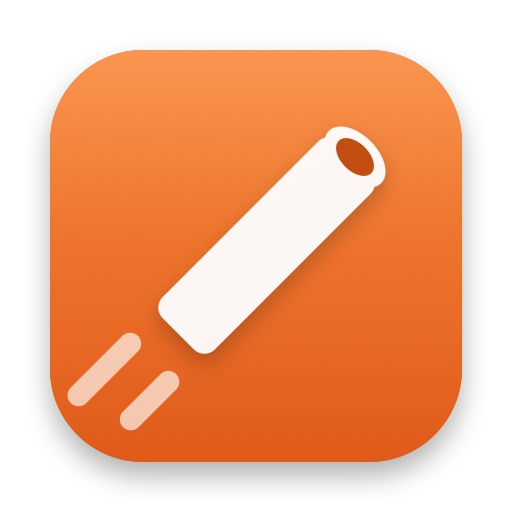
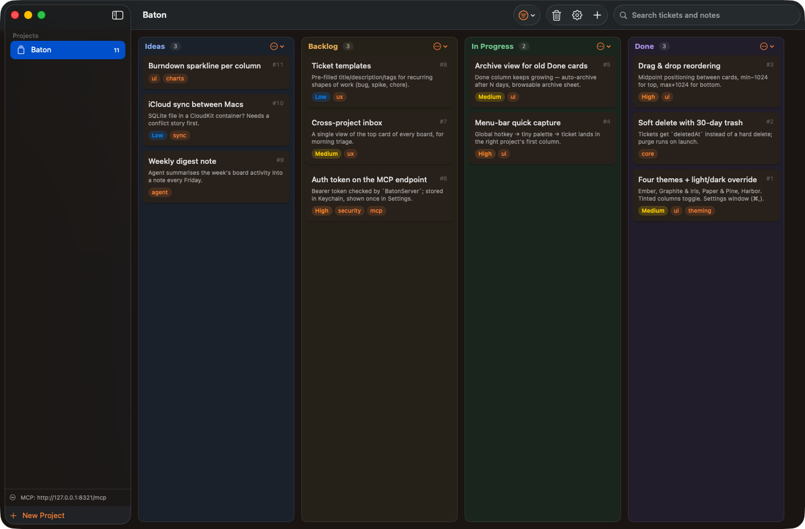
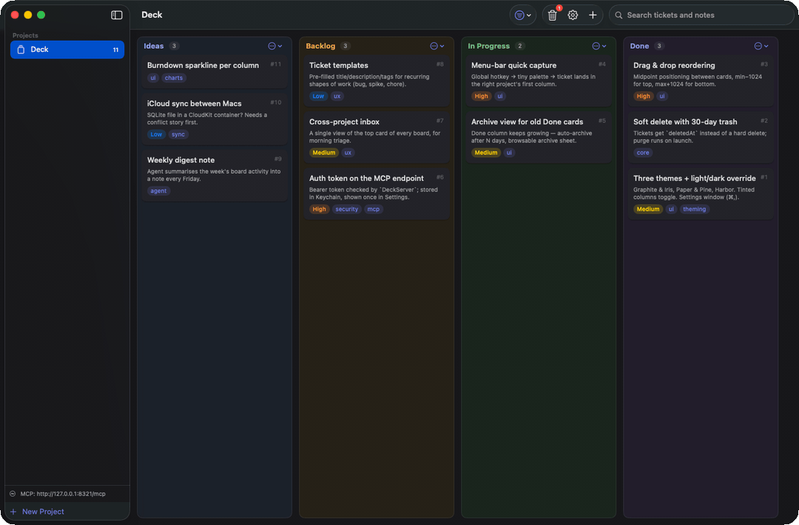
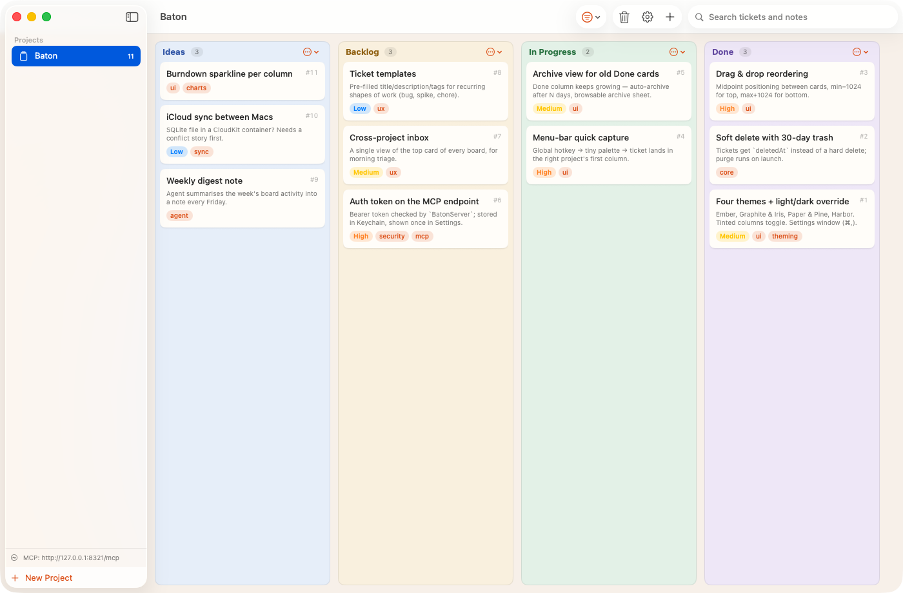
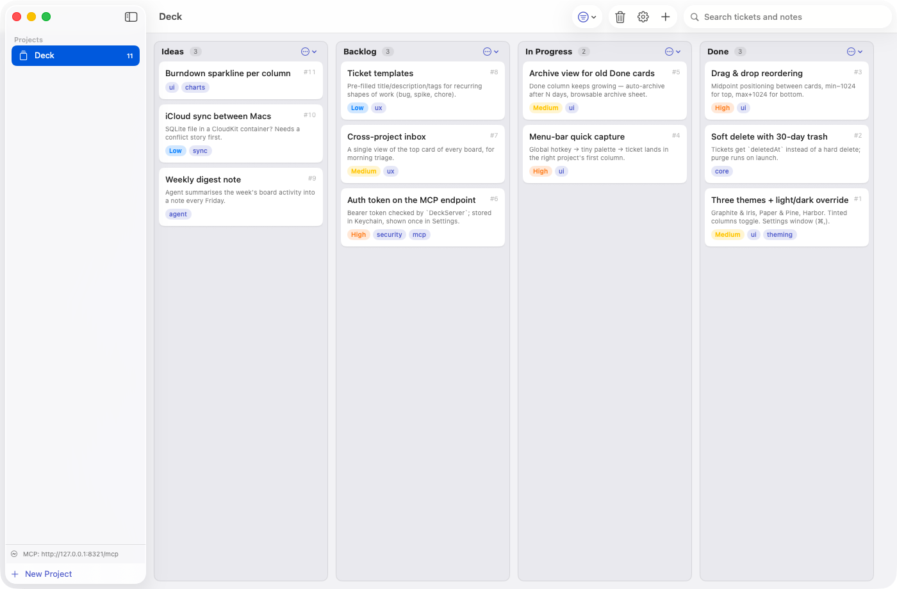
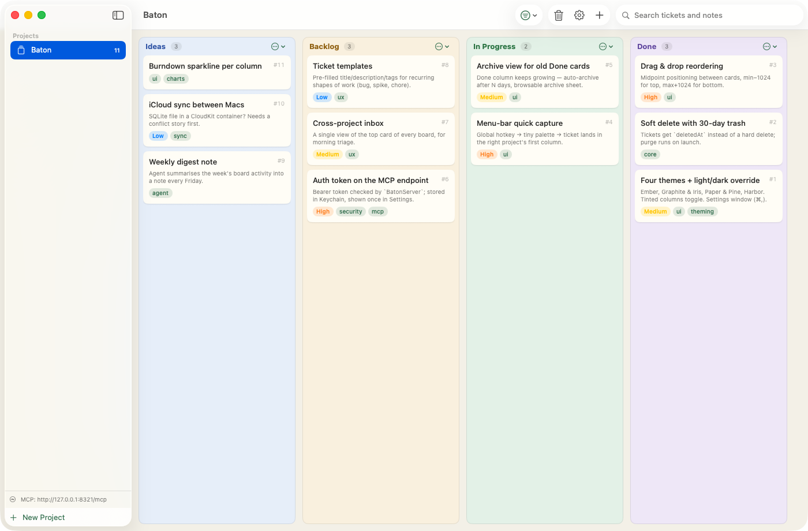
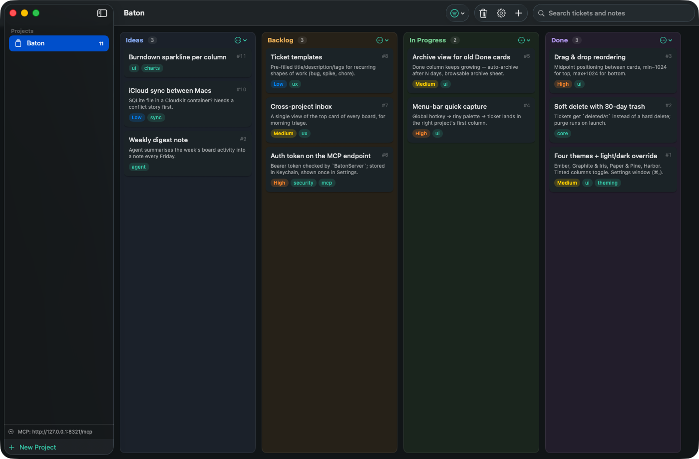

<div align="center">



# Baton

**A personal kanban board for macOS, built for you *and* your agent.**

You drag the cards. Claude files the ideas. Work passes between you like a baton.




</div>

---

Baton is a native SwiftUI kanban app with an MCP server built in. While you work with Claude Code (or any MCP-capable agent), ideas, bugs, and follow-ups inevitably come up mid-task — instead of losing them, your agent defers them straight onto your board, adds progress notes as work happens, and moves tickets between columns. You review, prioritise, and manage everything in a fast native app.

No Electron, no cloud, no account. One app, one SQLite file, one localhost port.

## ✨ How it works

Baton embeds a localhost HTTP server that speaks MCP (streamable HTTP) directly at `http://127.0.0.1:8321/mcp` — no proxy process, no per-repo setup. Data lives in SQLite at `~/Library/Application Support/Baton/baton.sqlite`.

- 🗂 **Projects are separate boards.** Each project registers one or more folder paths; when an agent passes its working directory, Baton resolves the right project automatically (longest path prefix wins).
- 📌 **Columns are yours to shape.** Boards start with *Ideas / Backlog / In Progress / Done*, but columns can be renamed, added, removed, and reordered per project — from the UI or by the agent.
- 🎫 **Tickets carry real context.** Title, markdown description, priority, tags, and an append-only notes timeline — with each note marked by author, so you can tell your thoughts from your agent's.
- 🗑 **Deletes are soft.** Trashed tickets are restorable for 30 days, then purged.
- 🔄 **Live everywhere.** MCP writes land in the running UI instantly — file a ticket from a Claude session and watch it appear at the top of the board:

<div align="center">

<br>
<sub>Claude files an idea mid-session, then moves a finished ticket to Done — no refresh, no polling.</sub>
</div>

> The MCP endpoint is only live while the app is running — Baton *is* the server.

## 🚀 Getting started

Requires macOS 14+ and the Swift 6 toolchain (Command Line Tools are enough; full Xcode not required). Baton builds from source on your machine, so there's no Gatekeeper quarantine to fight.

**Homebrew** (builds from source via a tap on this repo):

```sh
brew tap matthewalton/baton https://github.com/matthewalton/baton
brew install --HEAD baton
cp -R "$(brew --prefix baton)/Baton.app" /Applications/
```

**Or clone and build:**

```sh
git clone https://github.com/matthewalton/baton.git && cd baton
./scripts/build-app.sh     # builds dist/Baton.app (ad-hoc signed)
open dist/Baton.app
```

Move `dist/Baton.app` to `/Applications` if you like, or run it in place. Tests run with `./scripts/test.sh`.

### Connect Claude Code

The recommended route is the bundled **plugin** — it registers the MCP server for you, launches Baton at session start if it isn't already running, and adds board workflow skills:

```
/plugin marketplace add matthewalton/baton
/plugin install baton@baton
```

The skills — `/baton:capture`, `/baton:next`, `/baton:recap`, `/baton:triage` — are documented in [`skills/`](skills/README.md). You don't need to invoke them by name: Claude picks them up from natural language, so "add this as an idea", "what should I work on", or "where was I" just work.

Prefer just the raw tools? A plain MCP registration works too:

```sh
claude mcp add --transport http --scope user baton http://127.0.0.1:8321/mcp
```

Either way, Claude discovers the tools automatically; the server's instructions tell it to always pass its working directory so tickets land in the right project. Then, mid-session:

> *"Good idea, but out of scope — I'll put it on the board."* 🎉

### Connect other agents

Baton speaks standard MCP over streamable HTTP, so Codex, Cursor, Copilot, Gemini CLI, and any other MCP-capable agent connect with one config entry — and the server ships its usage conventions in the MCP `instructions` field, so every client's model picks them up automatically. Config snippets per agent are in [`docs/mcp.md`](docs/mcp.md).

## 🎨 Themes

Baton ships four hand-tuned palettes, each with matching light and dark variants. Pick yours in **Settings (⌘,)**, along with a light/dark override and a toggle for tinted columns (soft per-column hue washes that cycle across the board — shown in the hero shot above).

| Ember | Graphite & Iris | Paper & Pine | Harbor |
|:---:|:---:|:---:|:---:|
|  |  |  |  |
| Warm cream, burnt-orange accent — the default | Cool neutrals, indigo accent | Warm paper tones, forest green accent | Sea-glass blues, teal accent |

Priority badge colors stay fixed across themes, so urgent always reads as urgent. Even the app icon is code — rendered at build time by [`scripts/make-icon.swift`](scripts/make-icon.swift).

## 🛠 MCP tools

Fifteen tools cover the whole board: projects, columns, tickets, notes, moves, search, and trash/restore. The full table — plus how project resolution works — lives in [`docs/mcp.md`](docs/mcp.md).
